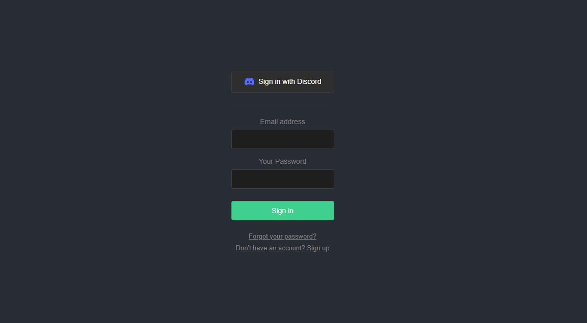

  <h1>Sejam muito bem vindos!!</h1>
  <strong>Login</strong>
  <h6>Feito com ❤️ by DebsLorena</h6>

 

## Login with supabase for discord, feito em React.JS

    
   

### 🎨 Frontend

*  **ReactJs**: com Visual Studio Code

## 🙌 Quer Contribuir?

Estamos abertos a todos os tipos de contribuições. Se você quiser:
* 🤔 Sugira um recurso
* 🐛 Informar um problema
* 📖 Melhore a documentação
* 👨‍💻 Contribua com o código

Você é mais que bem vindo. 

    <h6>Feito com ❤️ by DebsLorena</h6>
    <a href="https://www.linkedin.com/in/loredebs/"><strong>Linkedin</strong></a> 
    <a href="https://www.instagram.com/debslorena/"><strong>Instagram</strong></a>

